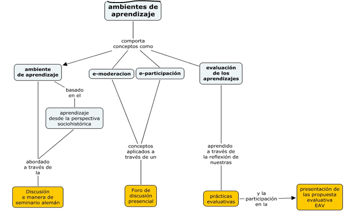

| PROGRAMA OFICIAL DE CURSO
(Pregrado y Posgrado)
| UNIVERSIDAD DE ANTIOQUIA

|INFORMACIÓN GENERAL | 
Unidad Académica: Facultad de Educación|
Programa académico al que pertenece: | Programa académico al que pertenece: | Programa académico al que pertenece: | Programa académico al que pertenece:
Programas académicos a los cuales se ofrece el curso: | Programas académicos a los cuales se ofrece el curso: | Programas académicos a los cuales se ofrece el curso: | Programas académicos a los cuales se ofrece el curso: | Programas académicos a los cuales se ofrece el curso: | Programas académicos a los cuales se ofrece el curso: | Programas académicos a los cuales se ofrece el curso:
Vigencia: | Código curso: | Código curso:
Nombre del curso: | Nombre del curso: | Nombre del curso:
Área o componente de formación del currículo: | Área o componente de formación del currículo: | Área o componente de formación del currículo: | Área o componente de formación del currículo: | Área o componente de formación del currículo: | Área o componente de formación del currículo: | Área o componente de formación del currículo: | Área o componente de formación del currículo: | Área o componente de formación del currículo: | Área o componente de formación del currículo: |  |  |  | 
Tipo de curso: | Tipo de curso: | Créditos académicos: | Créditos académicos: | Créditos académicos: | Créditos académicos: | Créditos académicos: | Créditos académicos:
Características del curso: Validable Habilitable Clasificable Evaluación de suficiencia | Características del curso: Validable Habilitable Clasificable Evaluación de suficiencia | Características del curso: Validable Habilitable Clasificable Evaluación de suficiencia | Características del curso: Validable Habilitable Clasificable Evaluación de suficiencia | Características del curso: Validable Habilitable Clasificable Evaluación de suficiencia | Características del curso: Validable Habilitable Clasificable Evaluación de suficiencia | Características del curso: Validable Habilitable Clasificable Evaluación de suficiencia | Características del curso: Validable Habilitable Clasificable Evaluación de suficiencia | Características del curso: Validable Habilitable Clasificable Evaluación de suficiencia | Características del curso: Validable Habilitable Clasificable Evaluación de suficiencia | Características del curso: Validable Habilitable Clasificable Evaluación de suficiencia | Características del curso: Validable Habilitable Clasificable Evaluación de suficiencia | Características del curso: Validable Habilitable Clasificable Evaluación de suficiencia | Características del curso: Validable Habilitable Clasificable Evaluación de suficiencia
Modalidad del curso: | Modalidad del curso: | Modalidad del curso: | Modalidad del curso: | Modalidad del curso: | Modalidad del curso: | Modalidad del curso: | Modalidad del curso: | Modalidad del curso: | Modalidad del curso: | Modalidad del curso: | Modalidad del curso: | Modalidad del curso: | Modalidad del curso:
Pre-requisitos: | Pre-requisitos: | Pre-requisitos: | Práctica Pedagógica IV | Práctica Pedagógica IV | Práctica Pedagógica IV | Práctica Pedagógica IV | Práctica Pedagógica IV | Práctica Pedagógica IV | Práctica Pedagógica IV | Práctica Pedagógica IV | Práctica Pedagógica IV | Práctica Pedagógica IV | Práctica Pedagógica IV
Co-requisitos: | Co-requisitos: | Co-requisitos:
Horas docencia directa: | Horas docencia directa: | Horas docencia directa: | Horas docencia directa: | Horas docencia directa: | Horas docencia directa: |  |  | Horas de trabajo independiente: | Horas de trabajo independiente: | Horas de trabajo independiente: | Horas de trabajo independiente: | Horas de trabajo independiente:
Horas totales del curso: | Horas totales del curso: | Horas totales del curso: | Horas totales del curso: | Horas totales del curso: | Horas totales del curso: | Horas totales del curso: | Horas totales del curso: | Horas totales del curso: | Horas totales del curso: | Horas totales del curso: | Horas totales del curso: | Horas totales del curso: | Horas totales del curso:
Profesor(a) que elaboró: Astrid Pineda Muriel, Gloria Inés Velásquez Velásquez | Profesor(a) que elaboró: Astrid Pineda Muriel, Gloria Inés Velásquez Velásquez | Profesor(a) que elaboró: Astrid Pineda Muriel, Gloria Inés Velásquez Velásquez | Profesor(a) que elaboró: Astrid Pineda Muriel, Gloria Inés Velásquez Velásquez | Profesor(a) que elaboró: Astrid Pineda Muriel, Gloria Inés Velásquez Velásquez | Correo electrónico:
astrid.pineda@udea.edu.co, gines.velasquez@udea.edu.co | Correo electrónico:
astrid.pineda@udea.edu.co, gines.velasquez@udea.edu.co | Correo electrónico:
astrid.pineda@udea.edu.co, gines.velasquez@udea.edu.co | Correo electrónico:
astrid.pineda@udea.edu.co, gines.velasquez@udea.edu.co | Correo electrónico:
astrid.pineda@udea.edu.co, gines.velasquez@udea.edu.co | Correo electrónico:
astrid.pineda@udea.edu.co, gines.velasquez@udea.edu.co | Correo electrónico:
astrid.pineda@udea.edu.co, gines.velasquez@udea.edu.co | Correo electrónico:
astrid.pineda@udea.edu.co, gines.velasquez@udea.edu.co | 

INFORMACIÓN ESPECÍFICA | INFORMACIÓN ESPECÍFICA | INFORMACIÓN ESPECÍFICA
Descripción general y justificación del curso: | Descripción general y justificación del curso: | Descripción general y justificación del curso:
Asumimos la práctica pedagógica como “el conjunto de relaciones teóricas y prácticas articuladas a las dimensiones pedagógica, educativa, didáctica, investigativa y disciplinar en contextos diversos. Esta relación, dinámica y compleja, estará cruzada por referentes éticos, ontológicos, históricos, culturales y políticos, que permitirá desde una actitud crítica y reflexiva consolidar la identidad de maestro (Documento Maestro Licenciatura en Educación Infantil, p. 1).
En este sentido, se puede comprender la práctica como un proceso de reflexión que potencia la apropiación de habilidades investigativas, miradas estas como un conjunto de preguntas y acciones que posibilitan lecturas interpretativas del aula o de otros escenarios educativos, de modo que puedan contribuir al desarrollo y al crecimiento profesional de los maestros en formación.
La Práctica Pedagógica V es un espacio que permite integrar, fundamentar y continuar el proceso de formación que llevan los estudiantes de la Licenciatura en Educación Infantil a lo largo de las cuatro prácticas anteriores y de los cursos que desarrollan en el pregrado. Como maestros en formación, los estudiantes deben desarrollar conocimientos, competencias y habilidades para posibilitar procesos de enseñanza-aprendizaje en Instituciones Educativas oficiales o privadas en las infancias. Para ello se hace necesario que, en su formación profesional, trabajen dentro de la escuela real para que se acerquen a ella y la comprendan a partir de la teoría que han construido en su formación inicial.
La educación inicial se constituye en un estructurante de la atención integral cuyo objetivo es potenciar de manera intencionada el desarrollo integral de las niñas y los niños desde su nacimiento hasta cumplir los ocho años, partiendo del reconocimiento de sus características y de las particularidades de los contextos en que viven y favoreciendo interacciones que se generan en ambientes enriquecidos a través de experiencias pedagógicas y prácticas de cuidado. La educación inicial es válida en sí misma por cuanto el trabajo pedagógico que allí se planea parte de los intereses, inquietudes, capacidades y saberes de las niñas y los niños. Esta no busca como fin último su preparación para la escuela primaria, sino que les ofrece experiencias retadoras que impulsan su desarrollo; allí juegan, exploran su medio, se expresan a través del arte y disfrutan de la literatura.
La Práctica Pedagógica V es un espacio de investigación en el aula que corresponde al quinto semestre de la Licenciatura en Pedagogía Infantil; hace énfasis en el desarrollo de los pensamientos y sistemas matemáticos. Lo anterior basándose en los Lineamientos Curriculares, los Estándares Básicos de Competencia y los Derechos Básicos de Aprendizaje para la Educación Matemática y la Educación Básica y Transición en Colombia. Esta se convierte en una oportunidad de interacción con el contexto educativo, en donde se pueden vivenciar diferentes ambientes de aprendizaje, experimentar metodologías, poner en acción teorías de la didáctica de las matemáticas, identificar problemas surgidos de la realidad, contrastar teorías, impulsar innovaciones y tener la posibilidad de producir saber pedagógico.
En concordancia con lo anterior, a partir de los Estándares, los Lineamientos y los DBA en matemáticas y preescolar, se trabajan aspectos transversales presentes en los procesos de enseñanza y aprendizaje, entre ellos está el planteamiento y la resolución de problemas, el cual también puede ser utilizado como metodología de enseñanza desde el nivel preescolar hasta el nivel universitario; en gran medida esta resolución de problemas lo que pretende es extender su teoría a la vida cotidiana en donde los niños tengan la capacidad de solucionar problemas que sobresaltan su realidad, como se menciona en el Proyecto Formación de Directivos Docentes en Antioquia. SEDUCA – FUNLAM, 2006 – 2008
“Tradicionalmente, se enseñaron contenidos y temas que se consideraba que todos los niños y niñas debían conocer. La Revolución Educativa, reflejada en la noción de competencia, propone que lo importante no es sólo conocer, sino también saber hacer. Se trata, entonces, de que las personas puedan usar sus capacidades de manera flexible para enfrentar problemas nuevos de la vida cotidiana” (p. 4).
La Práctica Pedagógica V se lleva a cabo a partir de la integración de los ejes: formativo, que involucra el saber histórico-pedagógico, los conocimientos que el estudiante ha apropiado acerca de los niños y las niñas y sus relaciones con el contexto y las personas que los rodean, las formas de enseñar y aprender las matemáticas al inicio y las dificultades que se presentan en ambos procesos; el disciplinar, que implica las competencias matemáticas (comunicación, representación y modelación, razonamiento y argumentación, planteamiento y resolución de problemas), y sus componentes (numérico-variacional, métrico-geométrico y aleatorio) en una etapa del desarrollo sensoriomotora y preoperacional y el inicio de la etapa operacional concreta; y el investigativo, donde se fortalece la observación estructurada, la escritura y la sistematización.
Para el desarrollo de los ejes, la Práctica Pedagógica V se compone del Seminario Integrativo (64 horas) y la asistencia al Centro de Práctica (40 horas).
En esencia, esta mirada de la práctica implica movilizar el pensamiento y lograr acceder a estructuras conceptuales cada vez más complejas en las cuales se visiona al maestro como planificador y hacedor de ambientes de aprendizaje enriquecedores que proporcionan experiencias educativa variadas, abiertas y flexibles, que contribuyen al desarrollo físico, intelectual, afectivo, social y ético de los niños y las niñas de las infancias que se encuentran en los primeros años de escolaridad; a su vez, se valida el ejercicio investigativo dentro y fuera del contexto del aula como alternativa de aprendizaje para todos los involucrados en el proceso y, en especial, como un aporte significativo en la construcción de cada subjetividad del maestro o maestra en formación.
A partir de esta perspectiva, los maestros en formación deben mirar los procesos de enseñanza y de aprendizaje en una concepción holística e integradora, en la que se reconoce la trascendencia de todos los espacios de formación a la luz de los cuales se gestarán la propuesta pedagógica. Además, los maestros en formación deben visualizarse como hacedores de su propio proceso en el cual se evalúan, reflexionan, construyen, deconstruyen y reconstruyen su práctica a través de la crítica, la reflexión y el ejercicio constante de escritura y de los elementos que la formación en investigación les proporciona.
En la Práctica Pedagógica V se les posibilita a los maestros en formación profundizar en sus prácticas con las infancias, se hace énfasis en los procesos sensoriales y preoperacionales que hacen parte de la construcción de los pensamientos matemáticos. Se busca fortalecer el intercambio de saberes entre los espacios de conceptualización ubicados en este nivel, lo cual conlleva a que dichos espacios se piensen en torno a la práctica pedagógica como unidad articuladora; que en su énfasis ofrece a los maestros en formación elementos para abordarla y desarrollarla con una actitud crítica, reflexiva y propositiva.
Los maestros de los primeros años tienen una visión más integral de los procesos de formación de los niños y, en esa integralidad, la formación en el área de las Matemáticas es fundamental.
Como lo plantea el maestro Freire (2006),
“…quien forma se forma y reforma al formar y quien está siendo formado se forma para posteriormente formar al ser formado. Es en este sentido que enseñar no significa sólo transferir conocimiento, contenidos, tampoco formar es la acción a través de la cual un sujeto creador da forma, estilo o alma a un cuerpo indeciso y acomodado. No existe docencia sin discencia, ambas se explican a sí mismas y sus sujetos, a pesar de las diferencias que los distinguen, no se reducen a la condición de objeto, a la relación del uno con el otro. Quien enseña aprende al enseñar y quien aprende enseña al aprender” (Pedagogía da autonomía, p. 25).
Es decir, en la medida que los maestros en formación enseñen a los niños se están formando en un ciclo o espiral ascendente.
De acuerdo a los aspectos anteriores, la práctica pedagógica realizada con los estudiantes durante el proceso de formación docente, permitirá visualizar la tarea educativa en una óptica integradora, en la cual se concibe que los procesos de formación, particularmente el desarrollo de los pensamientos matemáticos, son posibles a partir de las dinámicas y la riqueza de las interacciones entre los niños con los objetos y con las personas que los rodean; así mismo se concibe la práctica docente como un proceso permanente de formación.
En esta posición se asume la Práctica Pedagógica V, como un gran reto de formación mediado por las interacciones en diferentes escenarios: por una parte, los diferentes contextos educativos, incluido el contexto rural, sus dinámicas y cotidianidades del aula; por otra parte, el contexto de seminario, su dinámica de permanente reflexión mediada por la lectura, la escritura y los aportes de otros espacios de formación. Con base en lo anterior, la Práctica Pedagógica V concibe a los maestros en formación como hacedores de su propio perfil, como dinamizadores, copartícipes de su propia formación, en la práctica misma. | Asumimos la práctica pedagógica como “el conjunto de relaciones teóricas y prácticas articuladas a las dimensiones pedagógica, educativa, didáctica, investigativa y disciplinar en contextos diversos. Esta relación, dinámica y compleja, estará cruzada por referentes éticos, ontológicos, históricos, culturales y políticos, que permitirá desde una actitud crítica y reflexiva consolidar la identidad de maestro (Documento Maestro Licenciatura en Educación Infantil, p. 1).
En este sentido, se puede comprender la práctica como un proceso de reflexión que potencia la apropiación de habilidades investigativas, miradas estas como un conjunto de preguntas y acciones que posibilitan lecturas interpretativas del aula o de otros escenarios educativos, de modo que puedan contribuir al desarrollo y al crecimiento profesional de los maestros en formación.
La Práctica Pedagógica V es un espacio que permite integrar, fundamentar y continuar el proceso de formación que llevan los estudiantes de la Licenciatura en Educación Infantil a lo largo de las cuatro prácticas anteriores y de los cursos que desarrollan en el pregrado. Como maestros en formación, los estudiantes deben desarrollar conocimientos, competencias y habilidades para posibilitar procesos de enseñanza-aprendizaje en Instituciones Educativas oficiales o privadas en las infancias. Para ello se hace necesario que, en su formación profesional, trabajen dentro de la escuela real para que se acerquen a ella y la comprendan a partir de la teoría que han construido en su formación inicial.
La educación inicial se constituye en un estructurante de la atención integral cuyo objetivo es potenciar de manera intencionada el desarrollo integral de las niñas y los niños desde su nacimiento hasta cumplir los ocho años, partiendo del reconocimiento de sus características y de las particularidades de los contextos en que viven y favoreciendo interacciones que se generan en ambientes enriquecidos a través de experiencias pedagógicas y prácticas de cuidado. La educación inicial es válida en sí misma por cuanto el trabajo pedagógico que allí se planea parte de los intereses, inquietudes, capacidades y saberes de las niñas y los niños. Esta no busca como fin último su preparación para la escuela primaria, sino que les ofrece experiencias retadoras que impulsan su desarrollo; allí juegan, exploran su medio, se expresan a través del arte y disfrutan de la literatura.
La Práctica Pedagógica V es un espacio de investigación en el aula que corresponde al quinto semestre de la Licenciatura en Pedagogía Infantil; hace énfasis en el desarrollo de los pensamientos y sistemas matemáticos. Lo anterior basándose en los Lineamientos Curriculares, los Estándares Básicos de Competencia y los Derechos Básicos de Aprendizaje para la Educación Matemática y la Educación Básica y Transición en Colombia. Esta se convierte en una oportunidad de interacción con el contexto educativo, en donde se pueden vivenciar diferentes ambientes de aprendizaje, experimentar metodologías, poner en acción teorías de la didáctica de las matemáticas, identificar problemas surgidos de la realidad, contrastar teorías, impulsar innovaciones y tener la posibilidad de producir saber pedagógico.
En concordancia con lo anterior, a partir de los Estándares, los Lineamientos y los DBA en matemáticas y preescolar, se trabajan aspectos transversales presentes en los procesos de enseñanza y aprendizaje, entre ellos está el planteamiento y la resolución de problemas, el cual también puede ser utilizado como metodología de enseñanza desde el nivel preescolar hasta el nivel universitario; en gran medida esta resolución de problemas lo que pretende es extender su teoría a la vida cotidiana en donde los niños tengan la capacidad de solucionar problemas que sobresaltan su realidad, como se menciona en el Proyecto Formación de Directivos Docentes en Antioquia. SEDUCA – FUNLAM, 2006 – 2008
“Tradicionalmente, se enseñaron contenidos y temas que se consideraba que todos los niños y niñas debían conocer. La Revolución Educativa, reflejada en la noción de competencia, propone que lo importante no es sólo conocer, sino también saber hacer. Se trata, entonces, de que las personas puedan usar sus capacidades de manera flexible para enfrentar problemas nuevos de la vida cotidiana” (p. 4).
La Práctica Pedagógica V se lleva a cabo a partir de la integración de los ejes: formativo, que involucra el saber histórico-pedagógico, los conocimientos que el estudiante ha apropiado acerca de los niños y las niñas y sus relaciones con el contexto y las personas que los rodean, las formas de enseñar y aprender las matemáticas al inicio y las dificultades que se presentan en ambos procesos; el disciplinar, que implica las competencias matemáticas (comunicación, representación y modelación, razonamiento y argumentación, planteamiento y resolución de problemas), y sus componentes (numérico-variacional, métrico-geométrico y aleatorio) en una etapa del desarrollo sensoriomotora y preoperacional y el inicio de la etapa operacional concreta; y el investigativo, donde se fortalece la observación estructurada, la escritura y la sistematización.
Para el desarrollo de los ejes, la Práctica Pedagógica V se compone del Seminario Integrativo (64 horas) y la asistencia al Centro de Práctica (40 horas).
En esencia, esta mirada de la práctica implica movilizar el pensamiento y lograr acceder a estructuras conceptuales cada vez más complejas en las cuales se visiona al maestro como planificador y hacedor de ambientes de aprendizaje enriquecedores que proporcionan experiencias educativa variadas, abiertas y flexibles, que contribuyen al desarrollo físico, intelectual, afectivo, social y ético de los niños y las niñas de las infancias que se encuentran en los primeros años de escolaridad; a su vez, se valida el ejercicio investigativo dentro y fuera del contexto del aula como alternativa de aprendizaje para todos los involucrados en el proceso y, en especial, como un aporte significativo en la construcción de cada subjetividad del maestro o maestra en formación.
A partir de esta perspectiva, los maestros en formación deben mirar los procesos de enseñanza y de aprendizaje en una concepción holística e integradora, en la que se reconoce la trascendencia de todos los espacios de formación a la luz de los cuales se gestarán la propuesta pedagógica. Además, los maestros en formación deben visualizarse como hacedores de su propio proceso en el cual se evalúan, reflexionan, construyen, deconstruyen y reconstruyen su práctica a través de la crítica, la reflexión y el ejercicio constante de escritura y de los elementos que la formación en investigación les proporciona.
En la Práctica Pedagógica V se les posibilita a los maestros en formación profundizar en sus prácticas con las infancias, se hace énfasis en los procesos sensoriales y preoperacionales que hacen parte de la construcción de los pensamientos matemáticos. Se busca fortalecer el intercambio de saberes entre los espacios de conceptualización ubicados en este nivel, lo cual conlleva a que dichos espacios se piensen en torno a la práctica pedagógica como unidad articuladora; que en su énfasis ofrece a los maestros en formación elementos para abordarla y desarrollarla con una actitud crítica, reflexiva y propositiva.
Los maestros de los primeros años tienen una visión más integral de los procesos de formación de los niños y, en esa integralidad, la formación en el área de las Matemáticas es fundamental.
Como lo plantea el maestro Freire (2006),
“…quien forma se forma y reforma al formar y quien está siendo formado se forma para posteriormente formar al ser formado. Es en este sentido que enseñar no significa sólo transferir conocimiento, contenidos, tampoco formar es la acción a través de la cual un sujeto creador da forma, estilo o alma a un cuerpo indeciso y acomodado. No existe docencia sin discencia, ambas se explican a sí mismas y sus sujetos, a pesar de las diferencias que los distinguen, no se reducen a la condición de objeto, a la relación del uno con el otro. Quien enseña aprende al enseñar y quien aprende enseña al aprender” (Pedagogía da autonomía, p. 25).
Es decir, en la medida que los maestros en formación enseñen a los niños se están formando en un ciclo o espiral ascendente.
De acuerdo a los aspectos anteriores, la práctica pedagógica realizada con los estudiantes durante el proceso de formación docente, permitirá visualizar la tarea educativa en una óptica integradora, en la cual se concibe que los procesos de formación, particularmente el desarrollo de los pensamientos matemáticos, son posibles a partir de las dinámicas y la riqueza de las interacciones entre los niños con los objetos y con las personas que los rodean; así mismo se concibe la práctica docente como un proceso permanente de formación.
En esta posición se asume la Práctica Pedagógica V, como un gran reto de formación mediado por las interacciones en diferentes escenarios: por una parte, los diferentes contextos educativos, incluido el contexto rural, sus dinámicas y cotidianidades del aula; por otra parte, el contexto de seminario, su dinámica de permanente reflexión mediada por la lectura, la escritura y los aportes de otros espacios de formación. Con base en lo anterior, la Práctica Pedagógica V concibe a los maestros en formación como hacedores de su propio perfil, como dinamizadores, copartícipes de su propia formación, en la práctica misma. | Asumimos la práctica pedagógica como “el conjunto de relaciones teóricas y prácticas articuladas a las dimensiones pedagógica, educativa, didáctica, investigativa y disciplinar en contextos diversos. Esta relación, dinámica y compleja, estará cruzada por referentes éticos, ontológicos, históricos, culturales y políticos, que permitirá desde una actitud crítica y reflexiva consolidar la identidad de maestro (Documento Maestro Licenciatura en Educación Infantil, p. 1).
En este sentido, se puede comprender la práctica como un proceso de reflexión que potencia la apropiación de habilidades investigativas, miradas estas como un conjunto de preguntas y acciones que posibilitan lecturas interpretativas del aula o de otros escenarios educativos, de modo que puedan contribuir al desarrollo y al crecimiento profesional de los maestros en formación.
La Práctica Pedagógica V es un espacio que permite integrar, fundamentar y continuar el proceso de formación que llevan los estudiantes de la Licenciatura en Educación Infantil a lo largo de las cuatro prácticas anteriores y de los cursos que desarrollan en el pregrado. Como maestros en formación, los estudiantes deben desarrollar conocimientos, competencias y habilidades para posibilitar procesos de enseñanza-aprendizaje en Instituciones Educativas oficiales o privadas en las infancias. Para ello se hace necesario que, en su formación profesional, trabajen dentro de la escuela real para que se acerquen a ella y la comprendan a partir de la teoría que han construido en su formación inicial.
La educación inicial se constituye en un estructurante de la atención integral cuyo objetivo es potenciar de manera intencionada el desarrollo integral de las niñas y los niños desde su nacimiento hasta cumplir los ocho años, partiendo del reconocimiento de sus características y de las particularidades de los contextos en que viven y favoreciendo interacciones que se generan en ambientes enriquecidos a través de experiencias pedagógicas y prácticas de cuidado. La educación inicial es válida en sí misma por cuanto el trabajo pedagógico que allí se planea parte de los intereses, inquietudes, capacidades y saberes de las niñas y los niños. Esta no busca como fin último su preparación para la escuela primaria, sino que les ofrece experiencias retadoras que impulsan su desarrollo; allí juegan, exploran su medio, se expresan a través del arte y disfrutan de la literatura.
La Práctica Pedagógica V es un espacio de investigación en el aula que corresponde al quinto semestre de la Licenciatura en Pedagogía Infantil; hace énfasis en el desarrollo de los pensamientos y sistemas matemáticos. Lo anterior basándose en los Lineamientos Curriculares, los Estándares Básicos de Competencia y los Derechos Básicos de Aprendizaje para la Educación Matemática y la Educación Básica y Transición en Colombia. Esta se convierte en una oportunidad de interacción con el contexto educativo, en donde se pueden vivenciar diferentes ambientes de aprendizaje, experimentar metodologías, poner en acción teorías de la didáctica de las matemáticas, identificar problemas surgidos de la realidad, contrastar teorías, impulsar innovaciones y tener la posibilidad de producir saber pedagógico.
En concordancia con lo anterior, a partir de los Estándares, los Lineamientos y los DBA en matemáticas y preescolar, se trabajan aspectos transversales presentes en los procesos de enseñanza y aprendizaje, entre ellos está el planteamiento y la resolución de problemas, el cual también puede ser utilizado como metodología de enseñanza desde el nivel preescolar hasta el nivel universitario; en gran medida esta resolución de problemas lo que pretende es extender su teoría a la vida cotidiana en donde los niños tengan la capacidad de solucionar problemas que sobresaltan su realidad, como se menciona en el Proyecto Formación de Directivos Docentes en Antioquia. SEDUCA – FUNLAM, 2006 – 2008
“Tradicionalmente, se enseñaron contenidos y temas que se consideraba que todos los niños y niñas debían conocer. La Revolución Educativa, reflejada en la noción de competencia, propone que lo importante no es sólo conocer, sino también saber hacer. Se trata, entonces, de que las personas puedan usar sus capacidades de manera flexible para enfrentar problemas nuevos de la vida cotidiana” (p. 4).
La Práctica Pedagógica V se lleva a cabo a partir de la integración de los ejes: formativo, que involucra el saber histórico-pedagógico, los conocimientos que el estudiante ha apropiado acerca de los niños y las niñas y sus relaciones con el contexto y las personas que los rodean, las formas de enseñar y aprender las matemáticas al inicio y las dificultades que se presentan en ambos procesos; el disciplinar, que implica las competencias matemáticas (comunicación, representación y modelación, razonamiento y argumentación, planteamiento y resolución de problemas), y sus componentes (numérico-variacional, métrico-geométrico y aleatorio) en una etapa del desarrollo sensoriomotora y preoperacional y el inicio de la etapa operacional concreta; y el investigativo, donde se fortalece la observación estructurada, la escritura y la sistematización.
Para el desarrollo de los ejes, la Práctica Pedagógica V se compone del Seminario Integrativo (64 horas) y la asistencia al Centro de Práctica (40 horas).
En esencia, esta mirada de la práctica implica movilizar el pensamiento y lograr acceder a estructuras conceptuales cada vez más complejas en las cuales se visiona al maestro como planificador y hacedor de ambientes de aprendizaje enriquecedores que proporcionan experiencias educativa variadas, abiertas y flexibles, que contribuyen al desarrollo físico, intelectual, afectivo, social y ético de los niños y las niñas de las infancias que se encuentran en los primeros años de escolaridad; a su vez, se valida el ejercicio investigativo dentro y fuera del contexto del aula como alternativa de aprendizaje para todos los involucrados en el proceso y, en especial, como un aporte significativo en la construcción de cada subjetividad del maestro o maestra en formación.
A partir de esta perspectiva, los maestros en formación deben mirar los procesos de enseñanza y de aprendizaje en una concepción holística e integradora, en la que se reconoce la trascendencia de todos los espacios de formación a la luz de los cuales se gestarán la propuesta pedagógica. Además, los maestros en formación deben visualizarse como hacedores de su propio proceso en el cual se evalúan, reflexionan, construyen, deconstruyen y reconstruyen su práctica a través de la crítica, la reflexión y el ejercicio constante de escritura y de los elementos que la formación en investigación les proporciona.
En la Práctica Pedagógica V se les posibilita a los maestros en formación profundizar en sus prácticas con las infancias, se hace énfasis en los procesos sensoriales y preoperacionales que hacen parte de la construcción de los pensamientos matemáticos. Se busca fortalecer el intercambio de saberes entre los espacios de conceptualización ubicados en este nivel, lo cual conlleva a que dichos espacios se piensen en torno a la práctica pedagógica como unidad articuladora; que en su énfasis ofrece a los maestros en formación elementos para abordarla y desarrollarla con una actitud crítica, reflexiva y propositiva.
Los maestros de los primeros años tienen una visión más integral de los procesos de formación de los niños y, en esa integralidad, la formación en el área de las Matemáticas es fundamental.
Como lo plantea el maestro Freire (2006),
“…quien forma se forma y reforma al formar y quien está siendo formado se forma para posteriormente formar al ser formado. Es en este sentido que enseñar no significa sólo transferir conocimiento, contenidos, tampoco formar es la acción a través de la cual un sujeto creador da forma, estilo o alma a un cuerpo indeciso y acomodado. No existe docencia sin discencia, ambas se explican a sí mismas y sus sujetos, a pesar de las diferencias que los distinguen, no se reducen a la condición de objeto, a la relación del uno con el otro. Quien enseña aprende al enseñar y quien aprende enseña al aprender” (Pedagogía da autonomía, p. 25).
Es decir, en la medida que los maestros en formación enseñen a los niños se están formando en un ciclo o espiral ascendente.
De acuerdo a los aspectos anteriores, la práctica pedagógica realizada con los estudiantes durante el proceso de formación docente, permitirá visualizar la tarea educativa en una óptica integradora, en la cual se concibe que los procesos de formación, particularmente el desarrollo de los pensamientos matemáticos, son posibles a partir de las dinámicas y la riqueza de las interacciones entre los niños con los objetos y con las personas que los rodean; así mismo se concibe la práctica docente como un proceso permanente de formación.
En esta posición se asume la Práctica Pedagógica V, como un gran reto de formación mediado por las interacciones en diferentes escenarios: por una parte, los diferentes contextos educativos, incluido el contexto rural, sus dinámicas y cotidianidades del aula; por otra parte, el contexto de seminario, su dinámica de permanente reflexión mediada por la lectura, la escritura y los aportes de otros espacios de formación. Con base en lo anterior, la Práctica Pedagógica V concibe a los maestros en formación como hacedores de su propio perfil, como dinamizadores, copartícipes de su propia formación, en la práctica misma.
Objetivo general: | Objetivo general: | Objetivo general:
Objetivos específicos:
Orientar la formación de los estudiantes en la dimensión personal, investigativa y profesional docente o de la práctica pedagógica.
Implementar en diversos contextos elementos teóricos desarrollados en los espacios de conceptualización, fundamentalmente los relacionados con el desarrollo del pensamiento matemático en las infancias, desde un enfoque sociocultural.
Diseñar e implementar una propuesta pedagógica que posibilite el desarrollo del pensamiento matemático en los niños y niñas en las infancias.
Reflexionar sobre las diferentes movilizaciones que se logran en los niños en las infancias a nivel cognitivo y comportamental, valorando las adquisiciones y/o logros alcanzados a partir de la implementación de la propuesta y de la elaboración de relatos pedagógicos.
Presentar los resultados alcanzados en el que se dé cuenta del proceso vivido durante la Práctica Pedagógica.
Motivar a los maestros en formación para que trasciendan el rol de receptores de conocimiento y se visualicen como actores que aportan a la construcción de éste, a través de la interacción con los sujetos/objetos de estudio, así mismo a través de la reflexión permanente sobre su práctica.
Promover en los maestros en formación prácticas investigativas por medio de principios, conceptos, métodos y técnicas de investigación, pero fundamentalmente a través de lo concreto y lo vivencial.
Explorar diferentes formatos de sistematización de experiencias (material multimedia) con miras a la divulgación y publicación en revistas especializadas o eventos académicos en Educación Matemática.
Sensibilizar a las maestras en formación en todo lo relacionado con la ruralidad en la vida escolar- | Objetivos específicos:
Orientar la formación de los estudiantes en la dimensión personal, investigativa y profesional docente o de la práctica pedagógica.
Implementar en diversos contextos elementos teóricos desarrollados en los espacios de conceptualización, fundamentalmente los relacionados con el desarrollo del pensamiento matemático en las infancias, desde un enfoque sociocultural.
Diseñar e implementar una propuesta pedagógica que posibilite el desarrollo del pensamiento matemático en los niños y niñas en las infancias.
Reflexionar sobre las diferentes movilizaciones que se logran en los niños en las infancias a nivel cognitivo y comportamental, valorando las adquisiciones y/o logros alcanzados a partir de la implementación de la propuesta y de la elaboración de relatos pedagógicos.
Presentar los resultados alcanzados en el que se dé cuenta del proceso vivido durante la Práctica Pedagógica.
Motivar a los maestros en formación para que trasciendan el rol de receptores de conocimiento y se visualicen como actores que aportan a la construcción de éste, a través de la interacción con los sujetos/objetos de estudio, así mismo a través de la reflexión permanente sobre su práctica.
Promover en los maestros en formación prácticas investigativas por medio de principios, conceptos, métodos y técnicas de investigación, pero fundamentalmente a través de lo concreto y lo vivencial.
Explorar diferentes formatos de sistematización de experiencias (material multimedia) con miras a la divulgación y publicación en revistas especializadas o eventos académicos en Educación Matemática.
Sensibilizar a las maestras en formación en todo lo relacionado con la ruralidad en la vida escolar- | Objetivos específicos:
Orientar la formación de los estudiantes en la dimensión personal, investigativa y profesional docente o de la práctica pedagógica.
Implementar en diversos contextos elementos teóricos desarrollados en los espacios de conceptualización, fundamentalmente los relacionados con el desarrollo del pensamiento matemático en las infancias, desde un enfoque sociocultural.
Diseñar e implementar una propuesta pedagógica que posibilite el desarrollo del pensamiento matemático en los niños y niñas en las infancias.
Reflexionar sobre las diferentes movilizaciones que se logran en los niños en las infancias a nivel cognitivo y comportamental, valorando las adquisiciones y/o logros alcanzados a partir de la implementación de la propuesta y de la elaboración de relatos pedagógicos.
Presentar los resultados alcanzados en el que se dé cuenta del proceso vivido durante la Práctica Pedagógica.
Motivar a los maestros en formación para que trasciendan el rol de receptores de conocimiento y se visualicen como actores que aportan a la construcción de éste, a través de la interacción con los sujetos/objetos de estudio, así mismo a través de la reflexión permanente sobre su práctica.
Promover en los maestros en formación prácticas investigativas por medio de principios, conceptos, métodos y técnicas de investigación, pero fundamentalmente a través de lo concreto y lo vivencial.
Explorar diferentes formatos de sistematización de experiencias (material multimedia) con miras a la divulgación y publicación en revistas especializadas o eventos académicos en Educación Matemática.
Sensibilizar a las maestras en formación en todo lo relacionado con la ruralidad en la vida escolar-
Contenido: | Contenido: | Contenido:
Unidades:
Eje 1. Eje formativo y personal
Este eje parte del reconocimiento del Ser maestro como un arte, una profesión y una vocación. Un arte porque cada grupo, cada niño, necesita una variación, un ajuste y una atención personal, que exige sensibilidad, flexibilidad y originalidad.
Una profesión porque debe saber quiénes son los niños y cómo se desarrollan, además debe conocer muchas estrategias y metodologías y tener clara su visión de mundo y su rol como maestro. Pero, más allá de esto, tiene que tener la vocación necesaria para visualizar que su trabajo es contribuir a la formación de una persona que debe enfrentar sus propios retos y aprendizajes, que llega a la escuela con su alma, corazón, mente y espíritu dispuesto a ser lo mejor. De cada maestro depende, dentro del medio escolar, cuánto avanza, y cuándo aprende cada niño en todos los aspectos de su desarrollo: físico, intelectual y socioemocional.
El acto pedagógico es un conjunto de acciones, comportamientos y relaciones que se manifiestan en la interacción de un docente con los estudiantes mediados por unos componentes del proceso pedagógico y una intencionalidad claramente definidos.
De otro lado, en este eje se espera que los maestros en formación se reconozcan como profesionales partícipes en el desarrollo físico y motor, afectivo, comunicativo, social y cognitivo de los niños y las niñas; de allí que el reconocimiento de su vocación es fundamental para esta contribución.
En términos formativos se reconoce el juego estructurado como metodología de aprendizaje, que permite organizar las actividades para que los niños y las niñas puedan expresarse de manera creativa, al mismo tiempo que desarrollan el pensamiento matemático. | Temas:
Saberes fundamentales de un maestro para las infancias.
Vocacionalidad.
Posturas éticas sobre la relación consigo mismo, con la institución, los compañeros de trabajo, los niños, los padres de familia y la comunidad participante en la experiencia.
Disciplina inteligente: la norma y el rol del maestro en esta norma.
Reglamento de práctica.
El juego estructurado en las infancias.
El pensamiento matemático en las infancias. | Subtemas:
Preguntas orientadoras
¿Qué dicen los maestros en formación acerca de su vocación por la enseñanza?
¿Cuáles son las relaciones éticas con su vocación?
¿Cuál es el papel del pensamiento matemático en las infancias?
¿Cuál es el rol del maestro en las infancias?
¿Cuál es el perfil de un Licenciado en Educación Infantil?
¿De dónde van a salir los profesores que necesita el campo?, ¿cómo se va a garantizar su formación?
Eje 2. Eje investigativo
En este eje se espera que el maestro en formación se reconozca como un maestro investigador. Ser maestro investigador es trascender y llevar la educación más allá del aula. El maestro es quien dinamiza procesos y acciones educativas en la escuela, a partir de los cuales crea y recrea conocimiento, hábitos de conducta y formas de relación entre las personas.
El maestro investigador es aquel que no abandona el aula para hacer ciencia, la hace en su propia actividad profesional. Posee la base del conocimiento científico y lo aplica para solucionar los problemas que se manifiestan en la formación de los estudiantes.
Desde hace tiempo se defiende la necesidad del maestro investigador como un medio de mejora de la práctica educativa y de desarrollo del rol profesional del maestro. La expresión "maestro investigador" se vincula a Lawrence Stenhouse (1975) relacionada con un enfoque curricular que hace énfasis en la relevancia de los contenidos a procesos de investigación (Díaz Barriga, 1993). | Paradigmas y enfoques en investigación.
Técnicas e instrumentos de recolección de información: entrevista, observación participante, revisión documental, instrumentos audiovisuales, diario pedagógico.
Sistematización de experiencias como ejercicio investigativo.
Escritura científica.
Relatos pedagógicos | Preguntas orientadoras
¿Somos maestros investigadores?
¿Qué implicaciones tiene la investigación en el aula?
¿Cuáles son las formas de investigar que podemos implementar dentro del aula?
Eje 3. Eje disciplinar
El objeto de conocimiento posibilita llevar a diversos contextos, elementos teóricos desarrollados en los espacios de conceptualización, teniendo en cuenta la didáctica de los conceptos relacionados con los pensamientos matemáticos, las teorías de aprendizaje, la construcción del pensamiento pertinente al entorno sociocultural, la manera cómo aprenden los niños y las niñas, con la manera cómo enseña el maestro y cómo con sus acciones pedagógicas promueve el desarrollo infantil.
El docente en su ejercicio profesional enseña y construye saberes al enfrentarse a situaciones particulares del aula, como espacio dialéctico, donde convergen símbolos y significados en torno al currículo.
El eje disciplinar de la Práctica Pedagógica V es el pensamiento matemático en las infancias, el cual es visto en correspondencia con los planteamientos del MEN (2006) en donde se propone que la “Educación Matemática debe responder a nuevas demandas globales y nacionales, como las relacionadas con una educación para todos, la atención a la diversidad y a la interculturalidad y la formación de ciudadanos y ciudadanas con las competencias necesarias para el ejercicio de sus derechos y deberes democráticos” (p. 1). | La didáctica de las matemáticas.
Documentos rectores para las infancias, preescolar y matemáticas: lineamientos curriculares, estándares básicos de competencia, DBA, bases curriculares para educación inicial y preescolar.
Pensamiento matemático en las infancias: pensamiento numérico, pensamiento espacial, pensamiento métrico, pensamiento variacional y pensamiento aleatorio.
Pensamiento lógico en las infancias.
Procesos generales en matemáticas.
Educación Matemática en las infancias.
Secuencias didácticas y proyectos de aula.
Dificultades de aprendizaje de las matemáticas. | Preguntas orientadoras
¿Cómo se puede explicar la construcción y reconstrucción del saber pedagógico desde la perspectiva de los docentes, con referencia a su proceso de formación y práctica pedagógica?
¿Qué implicaciones tiene el rol del maestro investigador en las infancias?
¿Cómo propiciar experiencias posibilitadoras del aprendizaje con el saber matemático en las infancias?
¿Cómo propiciar el desarrollo del pensamiento matemático en las infancias a partir del desarrollo de competencias?

METODOLOGÍA
Metodológicamente La Práctica Pedagógica V se desarrolla a partir de los dos espacios que la conforman, el Seminario de Práctica Pedagógica y el Centro de Práctica. El Seminario de Práctica Pedagógica se desarrolla con la metodología de Seminario Investigativo o Seminario Alemán. Y la asistencia al Centro de Práctica se desarrolla a partir de la creación de ambientes de aprendizaje.
Seminario de Práctica Pedagógica
El Seminario de Práctica Pedagógica se desarrolla con la metodología de Seminario Investigativo o Seminario Alemán. El Seminario Investigativo o Seminario Alemán alude en su origen a una propuesta pedagógica de la universidad alemana del siglo XVIII para renovar las estrategias de estudio y formación de los especialistas superiores (investigadores). Con el seminario investigativo se postula la superación de los sistemas de estudio basados en los fundamentos y procedimientos didácticos de la lección.
La metodología de Seminario Investigativo integrará los ejes investigativo, personal, pedagógico y disciplinar que en cada caso correspondan, con el fin de que los maestros en formación adquieran una visión global de los procesos de la práctica.
La universidad alemana, obra de Kant, Hegel, Humbold, propone el seminario investigativo (o Seminario Alemán) como un grupo de personas que, orientadas por un miembro del colectivo en forma rotativa, se intercomunican en la común tarea de producción, reconstrucción o evaluación de un saber, o en la acción de exploración creadora sobre una temática u objeto-proceso de estudio. En el dominio de lo pedagógico, el seminario es un encuentro de iguales donde cada participante puede asumir en el proceso formativo integral los roles de director, relator, correlator, discursante y protocolante. Por tanto, no se establecen relaciones hegemónicas o jerárquicas rígidas, sino que, al contrario, se aprende a asumir diferentes funciones y tareas que, en su dinámica, implican niveles de alternación, complementación, coordinación y orientación. De esta forma, todos como individuos aportan en la tarea común y todos recogen los beneficios de la acción colectiva. Por lo anterior, el seminario supone un ambiente amable, jamás autoritario u hostil, más bien cooperativo y no competitivo, donde se asiste por propia iniciativa y por el placer de compartir lo que se sabe sobre un dominio del conocimiento y aprender del otro, como auténtico otro en la convivencia con uno, de manera que a un seminario jamás se asiste por obligación o imposición.
El Seminario Investigativo favorece el trabajo colaborativo para llevar a cabo la Práctica Pedagógica; ofrece importantes ventajas, en tanto los maestros en formación interactúan, dialogan y reflexionan en conjunto, se crean sinergias que posibilitan el desarrollo de las habilidades para percibir y reconocer lo esencial, las relaciones, comparar, valorar, definir, fundamentar, probar, refutar, concluir, aplicar analizar, sintetizar, inducir, deducir, identificar problemas, conducir diálogos de discusión, argumentar, etc.
Cada uno de los encuentros estarán encaminados a la realización actividades como: talleres, debates, exposiciones, trabajo en equipo, lecturas colectivas, socializaciones de productos, elaboración de protocolos y mapas conceptuales, búsqueda de información, juego de roles, lluvia de ideas, asesoría permanente, inducción, aprendizaje basado en problemas, charlas de expertos y visitas a los centros de práctica; todo ello para posibilitar procesos de formación desde los ejes centrales de la Práctica Pedagógica V (investigativo, personal, pedagógico y disciplinar) donde la discusión, interpretación y reflexión será el ejercicio constante que darán pie a la socialización de los saberes, las experiencias y la conceptualización. Es por esto que, se tendrá como soporte la lectura de algunos textos que permitirán elementos para la orientación y confrontación, del proceso en general. Estos procesos estarán dinamizados por actividades tanto individuales como grupales que permitirán a través del intercambio de saberes y experiencias mayores niveles de comprensión y conceptualización.
Las modalidades de trabajo que se implementarán durante los encuentros y las correspondientes actividades son: presencial, virtual y trabajo autónomo. Estas herramientas permitirán que los maestros en formación estén en permanente comunicación con el asesor y entre ellos mismos para solucionar dudas y avanzar en la apropiación del conocimiento.
El trabajo presencial se realizará durante los encuentros de seminarios. Este permitirá el intercambio de saberes y construcciones a partir de compromisos previos y de la planeación definida para el seminario. El trabajo virtual servirá como apoyo y asesoría por parte del docente y será desarrollado en momentos adicionales a los encuentros presenciales. Para hacer efectiva la comunicación a través de la virtualidad se utilizarán herramientas y aplicativos como: correo electrónico, Teams y WhatsApp.
Algunas de las actividades a desarrollar por los estudiantes con las modalidades de trabajo son:
Para el acompañamiento virtual, cada asesor dispondrá los espacios en la web (correo electrónico, WhatsApp, Teams) y desarrollará estrategias para que los estudiantes los apropien y usen en los momentos necesarios. En los casos en que la Universidad presente dificultades (asambleas, paros y anormalidad académica) la virtualidad será el mecanismo para mantener contacto con los estudiantes y para mantenerlos vinculados a los contenidos y procesos que se adelantan en el seminario, sobre todo lo relacionado con la práctica.
Respecto a los recursos para el desarrollo de la Práctica Pedagógica V, están: textos de referencia, documentos, fotocopias, material didáctico, videos, plataforma Teams, ayudas educativas.
Para el acompañamiento virtual, cada asesor dispondrá los espacios en la web (correo electrónico, WhatsApp, Teams) y desarrollará estrategias para que los estudiantes los apropien y usen en los momentos necesarios. En los casos en que la Universidad presente dificultades (asambleas, paros y anormalidad académica) la virtualidad será el mecanismo para mantener contacto con los estudiantes y para mantenerlos vinculados a los contenidos y procesos que se adelantan en el seminario, sobre todo lo relacionado con la práctica.
Respecto a los recursos para el desarrollo de la Práctica Pedagógica V, están: textos de referencia, documentos, fotocopias, material didáctico, videos, plataforma Edmodo, ayudas educativas.
Centro de Práctica
Para la asistencia a los Centros de Práctica se propone la implementación de ambientes de aprendizaje. Los ambientes de aprendizaje se asumen como espacios centrados más en el estudiante que en el profesor, en los que se promueve la participación, la interacción y la reflexión de los estudiantes para la construcción del conocimiento matemático (Parra-Zapata, 2015). El esquema siguiente sintetiza los objetivos a alcanzar con los ambientes de aprendizaje:
Para el desarrollo de los ambientes de aprendizaje se proponen dos estrategias metodológicas en torno a la enseñanza de las matemáticas en las infancias, para el diseño de las propuestas pedagógicas de intervención en el aula: las secuencias didácticas y los proyectos de aula.
Secuencia didáctica: “Una secuencia es un conjunto de actividades que guardan coherencia, cuya progresión está pensada en función de complejizar, resignificar o transformar ciertos conocimientos (...); cada actividad se engarza con otra, y en su conjunto permiten diferentes modos de aproximación a los contenidos propuestos, a la vez que favorecen que los alumnos complejicen, profundicen y enriquezcan sus conocimientos” (GCBA, 2000).
Una secuencia didáctica es una sucesión de elementos o hechos que mantienen un vínculo entre sí. Didáctico, por su parte, es un adjetivo que se vincula a las técnicas, los métodos y las pautas que favorecen un proceso educativo. Estos son los dos conceptos que conforman la definición que hoy les traemos: secuencia didáctica, y que hace referencia al conjunto de actividades educativas que, encadenadas, permiten abordar de distintas maneras un objeto de estudio. Todas las actividades deben compartir un hilo conductor que posibilite a los estudiantes desarrollar su aprendizaje de manera articulada y coherente.
El docente, a la hora de diseñar las secuencias didácticas, debe pensar variables didácticas. Según el ERMEL (1990): “Variable didáctica es una variable de la situación sobre la cual el docente puede actuar y que modifica las relaciones de los alumnos con las nociones en juego, provocando la utilización de distintas estrategias de resolución”.
Proyectos de aula: como estrategia de integración curricular el proyecto de aula se constituye en un pretexto para propiciar el desarrollo de las competencias investigativas y el pensamiento matemático, en tanto que involucra las competencias básicas (argumentativas, interpretativas y propositivas) y a su vez reconoce las competencias desde el pensamiento complejo que son propuestas por la Unesco; aprender a ser, aprender a conocer, aprender a hacer y aprender a vivir juntos. Las propuestas pedagógicas estructuradas desde los proyectos de aula, facilitan en la articulación de áreas de conocimiento, iniciativas de investigación y de procesos de construcción social del conocimiento. La relevancia de ésta estrategia didáctica consiste en llevar los conocimientos obtenidos en las diversas áreas de las disciplinas, por parte del estudiante, a un proyecto de investigación articulado a la proyección social.
El desarrollo de la Práctica Pedagógica V consta de las siguientes etapas:
1. Caracterización: es la lectura de la institución y del grupo de niños y niñas en el cual va a realizar su práctica. Esta lectura debe ser lo más sucinta posible pero que dé elementos claros para planificar e implementar el proyecto de práctica. Esta revisión se centra en aspecto como: conocimiento de las concepciones y prácticas de enseñanza y aprendizaje de las matemáticas en las infancias en el aula orientadas desde el Proyecto Educativo Institucional (PEI) y Plan de Estudio. Además, es una indagación en los estudiantes sobre las maneras cómo se relaciona con las matemáticas, sus concepciones, actitudes, maneras y procedimientos para aprender.
2. Diseño de un ambiente de aprendizaje para el aula: es el planteamiento de un ambiente de aprendizaje: una secuencia didáctica o proyecto de aula, que posibilite el desarrollo del pensamiento matemático en los niños, teniendo en cuenta el contexto y las particularidades de los estudiantes. Se trata de planear, de manera general, y en común acuerdo con el maestro o la maestra cooperadora, un proyecto o una situación que consideren que es pertinente.
3. Implementación de la propuesta pedagógica: es el desarrollo de la propuesta en cada uno de los encuentros con el grupo de estudiantes. El desarrollo entendido como un ir y venir mediatizado por la reflexión en los encuentros propios del Seminario de Práctica Pedagógica V, como un diálogo permanente entre la práctica y la teoría.
4. Evaluación del proceso: es el ejercicio permanente de observación, reflexión, análisis e interpretación, de todo lo que va pasando en cada uno de los encuentros con los grupos en los centros de práctica, con el fin de aprender para mejorar las siguientes prácticas. Se utilizan los relatos pedagógicos, las narrativas, los registros fotográficos, audios, videos y entrevistas como instrumentos para recoger la información.
5. Elaboración y presentación del informe de práctica: es el informe en el que se da cuenta de la experiencia vivida, a través de diferentes formatos (revista, artículo, blog, página web, afiche, vídeo, poster, infografía, entre otros) que permitan la sistematización de la experiencia. Lo anterior posibilita la participación de los estudiantes en eventos académicos y la publicación en revistas científicas. Las estudiantes harán devolución de la experiencia trabajada en el aula de una manera creativa
6. Socialización de la experiencia: es el evento que se programa por el comité de carrera, donde los maestros en formación como responsables de este evento, dan cuenta de los procesos vivenciados en la práctica desde lo disciplinar, lo personal, lo formativo y lo investigativo.
La práctica integrativa V, se ha estructurado en forma de guías, en las cuales se distribuyen las temáticas a trabajar durante el semestre.

Actividad de evaluación | Porcentaje | Fecha
30
30
10
15
Evaluación de la práctica | 15

Actividades de asistencia obligatoria:

Bibliografía:
Bibliografía básica.
Alsina, C. (2006). La matemática hermosa se enseña con el corazón. Sigma (29).143-150.
D’Amore, B., & Fandiño, M. (2015, April). La matemática en las aulas de Primera Infancia. In XVIII Congreso Internacional de Educación Inicial, Neiva: Confederación Nacional por la.
Delpech, B., Moratto, M. D., Gardella, M., Jakubecki, N., Marazzato, A. E., Luz, M. y Sonna, V. (2014). Material de apoyo para la redacción de trabajos académicos. Buenos Aires: Facultad de Filosofía y Letras, Universidad de Buenos Aires.
De Maura, M. (2012). La Matemática en la Infancia. En: Educación Matemática en la Infancia. Abordaciones y desafíos. Marlene da Rocha Migueis y María da Graca Acevedo. Organizadoras.
Díaz, B. y Sime, L. (2009). Una mirada a las técnicas e instrumentos de investigación. Pontificia Universidad Católica del Perú. Maestría en Educación Cultura Investigadora.
Espinosa, E. O. C., y Mercado, M. T. C. (2008). El desarrollo de las competencias matemáticas en la primera infancia. Escuela Superior de Comercio y Administración, Unidad Santo Tomás del Instituto Politécnico Nacional, México.
Freire, P. (2004). Cartas a quien pretende enseñar. Buenos Aires: Siglo XXI Editores.
Jara, O. y González, N. (2007). ¿Cómo sistematizar experiencias educativas? Cátedra UNESCO en ciencias de la educación. Instituto Pedagógico Latinoamericano y Caribeño. La Habana.
Ministerio de Educación Nacional. (1998). Lineamientos Curriculares de Matemáticas. Bogotá: Editorial Magisterio.
Ministerio de Educación Nacional. (1998). Lineamientos Curriculares de Preescolar. Bogotá: Editorial Magisterio.
Ministerio de Educación Nacional. (2006). Estándares Básicos de Competencias en Matemáticas. Bogotá: Editorial Magisterio.
Ministerio de Educación Nacional. (2010). Guía 13. Aprender y Jugar, Instrumento Diagnóstico de Competencias Básicas en Transición. Bogotá: Editorial Magisterio.
Ministerio de Educación Nacional. (2016). Derechos Básicos de aprendizaje V2 en Matemáticas. Bogotá: Editorial Magisterio.
Ministerio de Educación Nacional. (2016). Derechos Básicos de aprendizaje V1 en Transición. Bogotá: Editorial Magisterio.
Ministerio de educación. (2014). La literatura en la educación inicial. Serie de orientaciones pedagógicas para la educación inicial en el marco de la atención integral. Colombia. Panamericana. formas e Impresos S.A.
Ministerio de educación. (2014). El arte en la educación inicial. Serie de orientaciones pedagógicas para la educación inicial en el marco de la atención integral. Colombia. Panamericana. formas e Impresos S.A.
Ministerio de educación. (2017). Bases curriculares para la educación inicial y preescolar. BOGOTÁ. Jorge Camacho – ediciones.
Ministerio de educación. (2014). El juego en la educación inicial. Serie de orientaciones pedagógicas para la educación inicial en el marco de la atención integral. Colombia. Panamericana. formas e Impresos S.A.
Ministerio de educación. (2014). La exploración del medio en la educación inicial. Serie de orientaciones pedagógicas para la educación inicial en el marco de la atención integral. Colombia. Panamericana. formas e Impresos S.A.
Ministerio de Educación Nacional (2001). Más campo para la Educación Rural. Al tablero, marzo 2001
PPT. (s.f.). Disciplina Inteligente, Diplomado 0xx0, Modulo 4. febrero 2008. Tecnológico de Monterrey
Vélez, C. (s.f.). El seminario Investigativo.
Zabalza M, A. (2004). Diarios de Clase. Madrid. Narcea, S.A.
Zabalza, Miguel (2000): Equidad y calidad en la educación Infantil. Una lectura desde el currículo. Ponencia en Simposio Mundial de educación Infantil, Santiago de Chile
Bibliografía de referencia.
Boavida, A. M. (2001). Sobre colaboração e investigação colaborativa. Manuscrito no Publicado.
Chamorro, M d C. (2005). Didáctica de las matemáticas para Educación Preescolar. Madrid. Pearson Educación.
Chamorro, M d C. (2005). Didáctica de las matemáticas para Educación Primaria. Madrid. Pearson Educación.
De Castro, C. y Escorial, B. (s.f.). Aprendiendo matemáticas a través de proyectos: una experiencia inspirada en el enfoque de Reggio Emilia. Centro Superior de Estudios Universitarios La Salle, Madrid Colegio “Las Naciones” de Madrid.
Escorial, B. y De castro, C. (2011). La gran torre: Matemática en la Educación Infantil a través de un proyecto de construcción. Números, revista de Didáctica de las Matemáticas, 78, 135 – 156.
Freire, P. (2006). Pedagogía de la Autonomía. Saberes necesarios para la práctica educativa. Madrid, Siglo XXI Editores.
Gailivro, J. (2007). Traducido por: José Darío Quijano Mesa, estudiante de Traducción Inglés, francés, español. Universidad de Antioquia.
Galeano, M. (2004). Estrategias de investigación social cualitativa, el giro en la mirada. Medellín: La carreta editores.
González, A. y Weinstein, E. (2006). Implicancias didácticas del enfoque de la resolución de problemas.
González, A. y W Einstein, E. (2006). La enseñanza de la Matemática en el Jardín de Infantes. Argentina. Homo Sapiens Ediciones. Capítulo I, Implicancias didácticas del enfoque de la resolución de problemas.
Guba, E. y Lincoln, Y. (2002). Paradigmas en competencia en la investigación cualitativa. Denman C, Haro J. (comps.). Por los rincones. Antología de métodos cualitativos en la investigación social. El Colegio de Sonora. Hermosillo, Sonora, México, 113-45.
Guibert, A., Lebeaume, J. y Mousset, R. (1993). Actividades geométricas. Para educación Infantil y primaria. Madrid. Narcea S.A.
Hernández, R., Fernández, C. y Baptista, P. (1996). Metodología de la Investigación. México: McGrawHill.
Jiménez, M. (s.f.). ¿Por qué los niños y las niñas no aprenden matemáticas?
Kavale, S. (1996). InterViews: An Introduction to Qualitative Research Interviewing. London. 124-159.
Mariño, G. (2011). Sistematización de experiencias: una propuesta desde la educación popular. Se encuentra bajo una Licencia Creative Commons Atribución-No Comercial-Licenciamiento Recíproco 3.0 Unported. Documento de Trabajo. Bogotá.
Muñoz, F. (s.f.). Cómo desarrollar competencias investigativas en educación. Editorial aula abierta
Parra-Zapata, M.M. (2015). Participación de estudiantes de quinto grado en ambientes de modelación matemática. reflexiones a partir de la perspectiva socio-crítica de la modelación matemática. Tesis de Maestría. Universidad de Antioquia. Medellín: Colombia.
Pérez, G., García, G., Nocedo, I. y García, M. (1996/2001). Metodología de la investigación educacional (1ª reimpresión). Primera parte. La Habana: pueblo y educación.
Restrepo, B. (2002). Investigación en educación. Bogotá. ARFO Editores e Impresores Ltda.
Rodríguez, A. L. (2004). Aprendiendo a sistematizar: una propuesta metodológica. Orientación, coordinación y asesoría COSUDE - Colombia. Dimensión Educativa.

Profesores | Profesores | Profesores | Profesores | Profesores | Profesores
Nombres y Apellidos | Dependencia | Formación en pregrado y posgrado | Unidad N° | N° Horas | Fechas
Mary Luz Castro Castro | Facultad de Educación | Magister en educación |  |  | 
 |  |  |  |  | 

Aprobación del Consejo de Unidad Académica | Aprobación del Consejo de Unidad Académica | Aprobación del Consejo de Unidad Académica | Aprobación del Consejo de Unidad Académica | Aprobación del Consejo de Unidad Académica | Aprobación del Consejo de Unidad Académica | Aprobación del Consejo de Unidad Académica | Aprobación del Consejo de Unidad Académica | Aprobación del Consejo de Unidad Académica
Aprobado en Acta del . | Aprobado en Acta del . | Aprobado en Acta del . | Aprobado en Acta del . | Aprobado en Acta del . | Aprobado en Acta del . | Aprobado en Acta del . | Aprobado en Acta del . | Aprobado en Acta del .
 |  |  |  |  |  |  |  | 
 | Nombre Completo Secretario del Consejo de la Unidad Académica |  | Firma | Firma | Firma |  | Cargo | 
 |  |  |  |  |  |  |  | 

